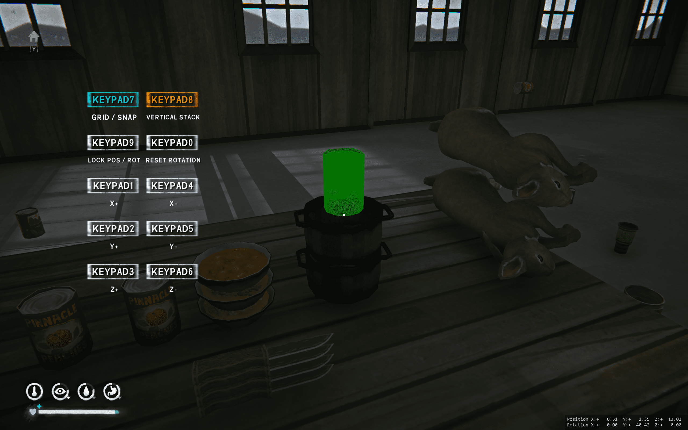

# Placing Geometrically / 几何学摆放

## Overview / 简介

A variant of the original placement mod that adds grid-based and more structured placement options, while keeping full free-placement capability.

这是一个基于原始摆放Mod修改的变体，在保留自由摆放功能的同时，增加了网格化与更有结构的摆放方式。

Based on / 基于：  
https://github.com/DigitalzombieTLD/tld-placing-anywhere

## Features / 功能

- Free placement without restrictions  
  无限制自由摆放  

- Grid placement mode for aligned building  
  网格摆放模式（用于整齐对齐）  

- Snap-to-object placement (XZ plane)  
  吸附到物体表面（XZ平面）  

- Vertical stacking using collision (Y axis)  
  基于碰撞的高度叠放（Y轴）  

- Fine placement mode with precise control  
  精细摆放模式（高精度控制）  

- Adjustable movement step and rotation precision  
  可调移动步长与旋转精度  

- Coordinate / rotation mode switching  
  坐标与旋转模式切换  

- Reset rotation to default  
  一键旋转归零  

- Optional XYZ axis fine adjustment via hotkeys  
  可选XYZ轴快捷键微调  

- Configurable HUD position  
  HUD位置可调整  

---

## Usage / 使用说明

Enable **Free Placement** to unlock the system.  
Turn on **Fine Placement Mode** to access advanced controls.  
Use hotkeys to switch placement modes and adjust position or rotation.

开启“自由摆放”以启用功能。  
开启“精细摆放模式”以使用高级控制。  
通过快捷键切换模式并调整位置或旋转。

---

## Notes / 说明

This mod extends the original mod by adding grid-based placement and better structured building options.

该Mod在原版基础上扩展，重点增加了网格摆放功能，使建造更加规整与可控。

Designed for players who want both freedom and precision in object placement.

适用于既需要自由度又需要精确控制的玩家。
